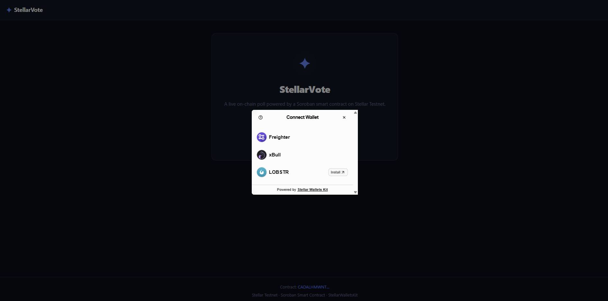
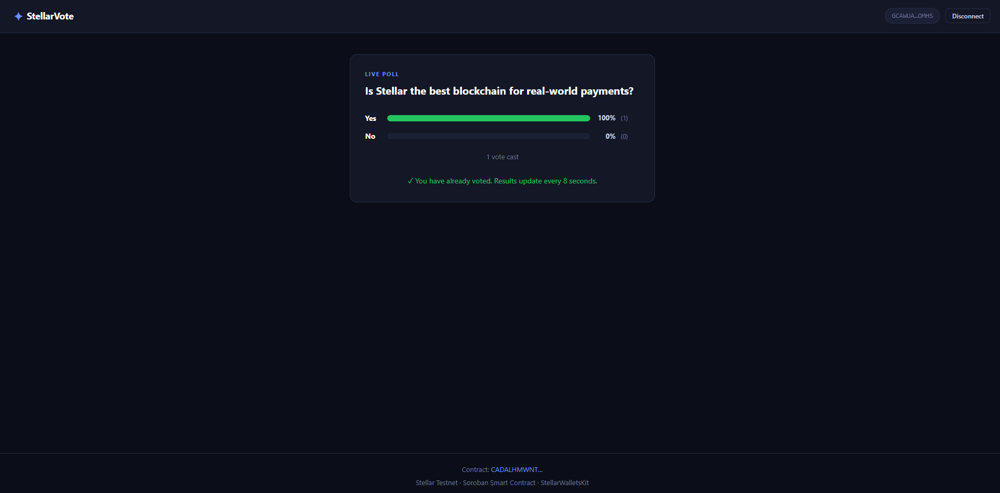

# StellarVote — Live On-Chain Poll

A live-voting dApp built on **Stellar Testnet** using a Soroban smart contract. Users connect any supported wallet (Freighter, xBull, LOBSTR), cast a Yes/No vote stored immutably on-chain, and watch results update in real-time via Soroban RPC event polling.

## Live Demo

> **[🚀 Live App →](https://stellar-vote-ashen.vercel.app)**

## Deployed Contract

| | |
|---|---|
| **Contract ID** | `CADALHMWNTTNI5PCQYKKVEHIVCWZK2PP7OILEVVCO2CLQT2WFY7X6RGI` |
| **Network** | Stellar Testnet |
| **Explorer** | [View on Stellar Expert](https://stellar.expert/explorer/testnet/contract/CADALHMWNTTNI5PCQYKKVEHIVCWZK2PP7OILEVVCO2CLQT2WFY7X6RGI) |
| **Deploy tx** | [49962920...](https://stellar.expert/explorer/testnet/tx/49962920c919d1424a869c50d2b51743a3fcc4eb684b317d79a7c32b8ab5c08c) |
| **Init tx** | [2ff2b00f...](https://stellar.expert/explorer/testnet/tx/2ff2b00ff533dad009c791ab473f43bf89f392b645576b7274752b431bbf4a18) |

## Requirements Met

- **Multi-wallet**: StellarWalletsKit — Freighter, xBull, LOBSTR via a single modal
- **Contract deployed on testnet**: `CADALHMWNTTNI5PCQYKKVEHIVCWZK2PP7OILEVVCO2CLQT2WFY7X6RGI`
- **Contract called from frontend**: `vote()`, `get_votes()`, `has_voted()` via Soroban RPC
- **Transaction status**: Pending spinner → success with Explorer link → failure with error
- **3 error types handled**:
  1. `wallet_not_found` — extension not installed
  2. `user_rejected` — user cancelled signing
  3. `insufficient_balance` — not enough XLM for fee
  - (+ `already_voted` and `timeout` for completeness)
- **Real-time events**: Soroban ledger events polled every 8 seconds for the Recent Votes feed

## Tech Stack

| Layer | Technology |
|---|---|
| Frontend | React 19 + Vite |
| Wallets | `@creit.tech/stellar-wallets-kit` v2 |
| Stellar SDK | `@stellar/stellar-sdk` v15 |
| Contract | Soroban (Rust), `soroban-sdk` v22 |
| Network | Stellar Testnet, Soroban RPC |

## Contract Functions

```rust
init(env, question: Symbol)             // Initialize the poll (once)
vote(env, voter: Address, option: Symbol) // Cast "yes" or "no" vote
get_votes(env, option: Symbol) -> u32   // Read vote count
has_voted(env, voter: Address) -> bool  // Check if address voted
question(env) -> Symbol                 // Get the question
```

## Setup & Run Locally

```bash
# 1. Clone
git clone https://github.com/Ayushjo/stellar-vote.git
cd stellar-vote

# 2. Install
npm install

# 3. Configure (contract is already deployed — just copy the env)
cp .env.example .env
# .env already has VITE_CONTRACT_ID set to the deployed contract

# 4. Start dev server
npm run dev
```

Open http://localhost:5173

## Deploy Your Own Contract

```bash
# Install Rust and Stellar CLI, then:

# Add WASM target
rustup target add wasm32v1-none

# Build
stellar contract build

# Generate and fund a deployer
stellar keys generate deployer --network testnet
# Fund via https://friendbot.stellar.org/?addr=<ADDRESS>

# Deploy
stellar contract deploy \
  --wasm target/wasm32v1-none/release/poll.wasm \
  --source deployer \
  --network testnet

# Initialize (replace CONTRACT_ID)
stellar contract invoke \
  --id <CONTRACT_ID> --source deployer --network testnet \
  -- init --question "poll"

# Update .env
echo "VITE_CONTRACT_ID=<CONTRACT_ID>" > .env
```

## Screenshots

### Wallet Options Modal


### Successful Vote


## License

MIT
